# Jira Convention — SBA301-BRO73

## 1. Cấu trúc Work Types

| Type                  | Mô tả                                                    | Người tạo           |
| --------------------- | -------------------------------------------------------- | ------------------- |
| Task                  | 1 PR cụ thể (BE hoặc FE), hoàn thành trong 1–2 ngày      | Scrum Master / Lead |
| Bug                   | Lỗi phát hiện trong quá trình dev hoặc review            | Bất kỳ ai           |
| Request Review        | Yêu cầu review approach / study — tạo **trước khi code** | Dev được assign     |
| Request Review Coding | Yêu cầu review code / PR — tạo **sau khi có PR**         | Dev được assign     |

---

## 2. Cấu trúc Task — 1 feature = 2 Tasks = 2 PRs

> ⚠️ **Phần này do Leader tạo và quản lý.** Các thành viên chỉ cần quan tâm đến Task được assign cho mình.

Mỗi tính năng được tách thành **2 Tasks riêng biệt** — 1 cho BE, 1 cho FE.
Mỗi Task = **1 PR** trên repo tương ứng.

```
Feature: Quản lý Branch
  ├── Task: [BE] Branch — Setup entity & CRUD API     ← 1 PR ở backend repo
  └── Task: [FE] Branch — Danh sách & form tạo/sửa   ← 1 PR ở frontend repo
```

**Quy tắc chia Task (Leader quyết định):**

- Mỗi Task hoàn thành trong **1–2 ngày làm việc**
- PR size: tối đa **~300 dòng thay đổi** để review được
- Nếu BE hoặc FE quá lớn → tách tiếp thành 2 Task nhỏ hơn

---

## 3. Quy trình Review — Request Review & Request Review Coding

Khi được assign Task, dev **bắt buộc tạo đúng 2 ticket review** và dán ID vào description Task cha:

```
Task: [BE] Branch — Setup entity & CRUD API  (assigned: dev)
  │
  ├── Request Review         ← tạo trước khi code, assigned: Nguyên
  └── Request Review Coding   ← tạo sau khi có PR,  assigned: Nguyên
```

**Trong description Task cha, dev điền:**

```
Request Review:
Request Review Coding:
```

---

### Request Review — Trước khi code

Dev tạo ticket type **Request Review**, assign cho **Nguyên**, điền description:

```
## Việc cần làm
- [ ] Tạo entity Branch + migration
- [ ] BranchRepository (JPA)
- [ ] BranchService — CRUD logic
- [ ] BranchController — 4 endpoints
- [ ] Unit test BranchService

## Ảnh hưởng đến team
- Task phụ thuộc vào API này: [FE] Branch form (SBA-XX)
- Block ai không: ...
- Cần thống nhất gì với ai trước khi code: ...

## Estimate
X ngày — lý do nếu khác estimate gốc
```

**Cách tạo:**

**Bước 1:** Ấn nút Create task

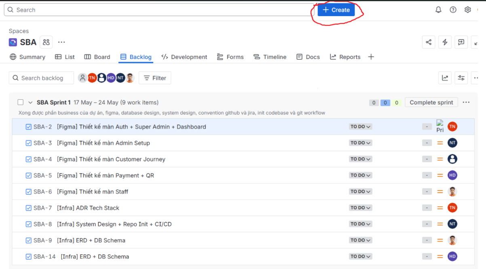

**Bước 2:** Chọn loại ticket → chọn **Request Review**

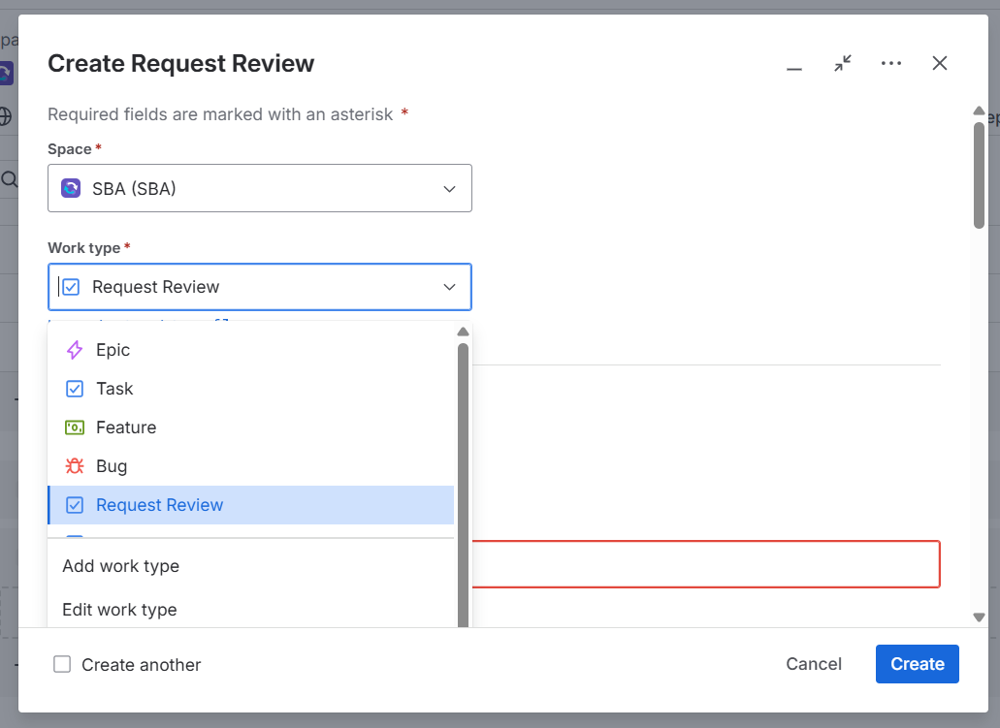

**Bước 3:** Điền Summary (tên task) và Description (theo template trên)

> 📌 **Đặt tên đúng convention (xem [Mục 4](#4-ticket-naming-convention)):**
> `[Review] BE Branch — Setup entity & CRUD API`

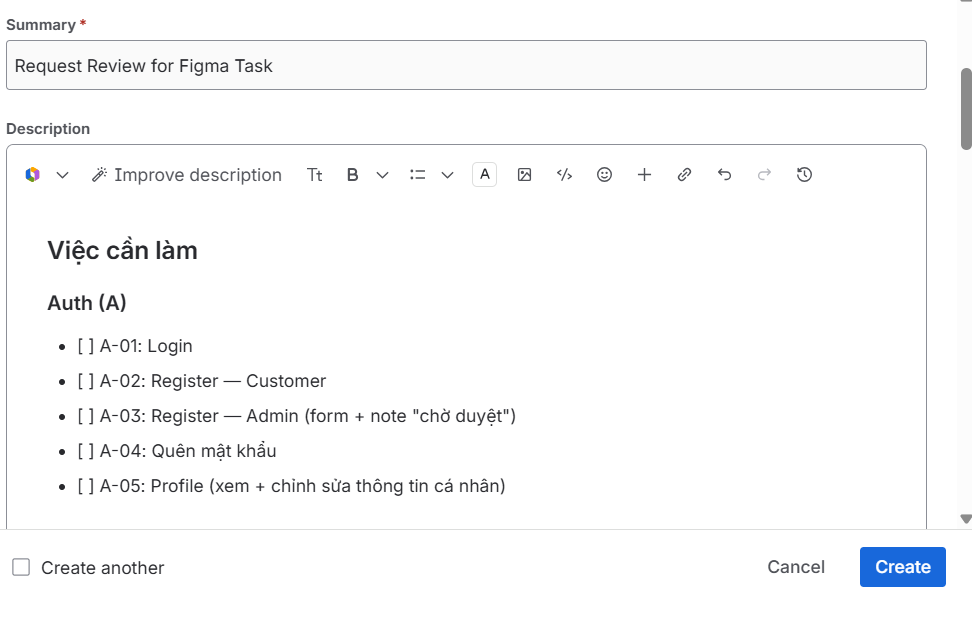

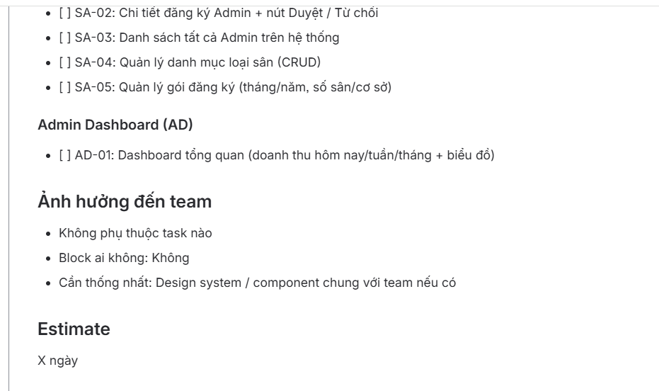

**Bước 4:** Assign cho Leader

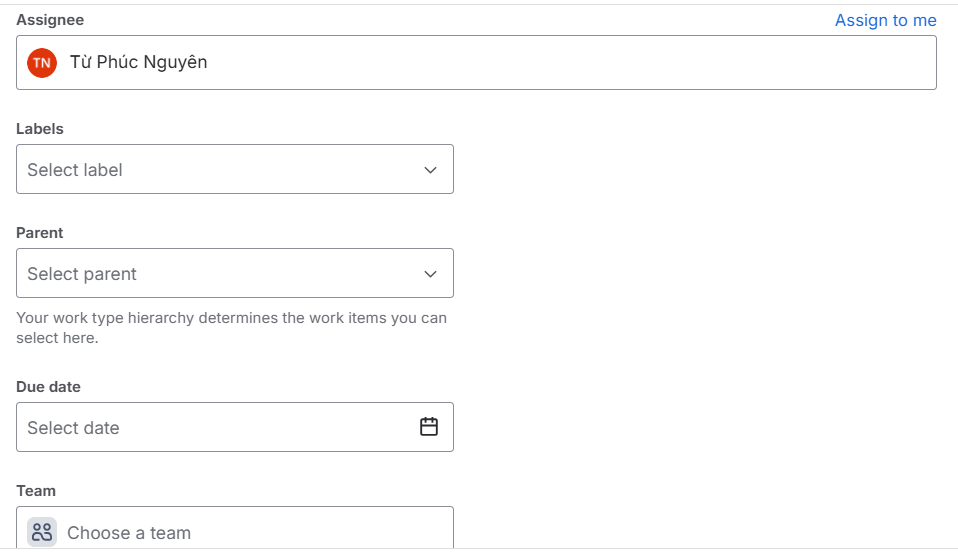

**Bước 5:** Ấn vào task vừa tạo (thường nằm dưới Backlog) → chọn **Copy link**

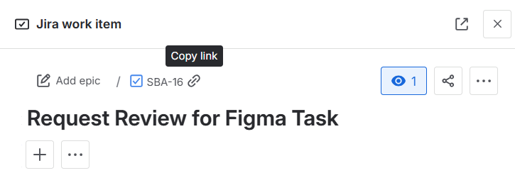

**Bước 6:** Vào Task cha được assign → chọn **Linked work item** → paste link vừa copy

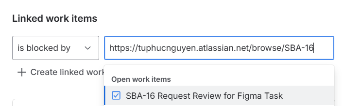

---

### Request Review Coding — Sau khi có PR

Dev tạo ticket type **Request Review Coding**, assign cho **Nguyên**, điền description:

```
## PR Link
- PR: https://github.com/org/repo/pull/XX

## Checklist trước khi request review
- [ ] Self-review code
- [ ] Không có conflict với dev
- [ ] Unit test pass
- [ ] Build pass (CI xanh)
- [ ] Đã update Task cha sang In Review
```

**Cách tạo:**

**Bước 1:** Tạo ticket → chọn loại **Request Review Coding**

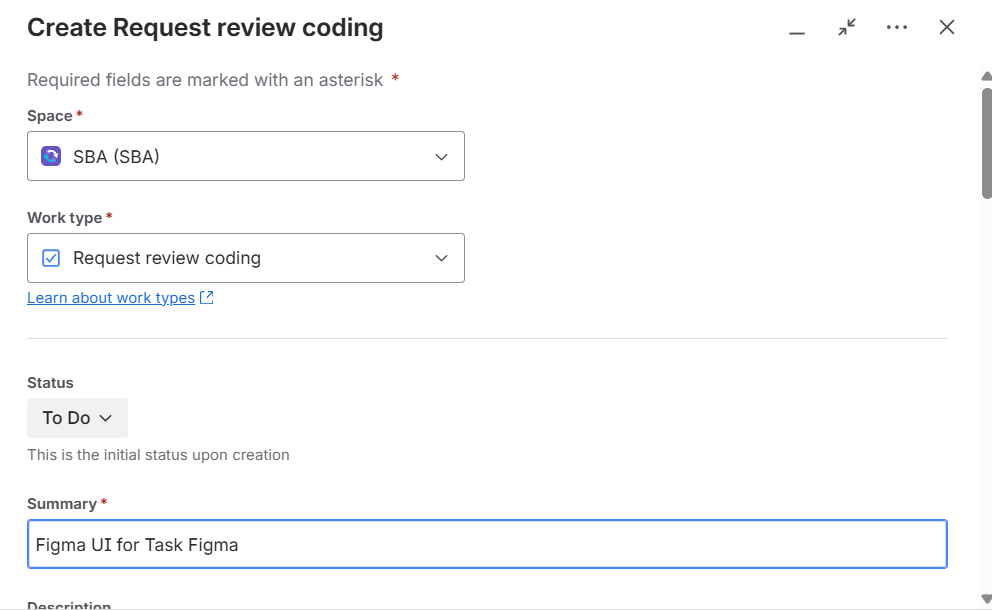

**Bước 2:** Điền Summary và dán PR link vào Description

> 📌 **Đặt tên đúng convention (xem [Mục 4](#4-ticket-naming-convention)):**
> `[Code Review] BE Branch — Setup entity & CRUD API`

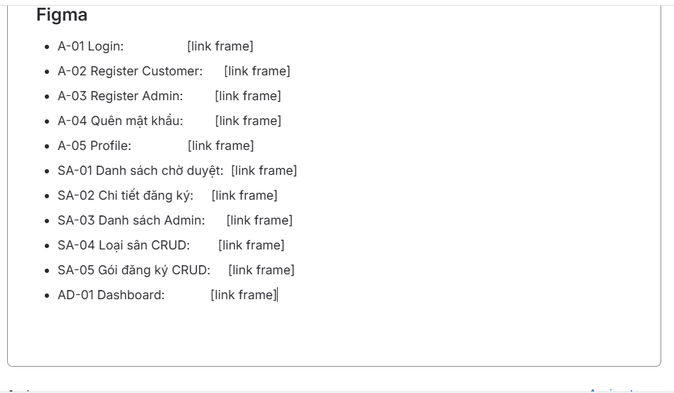

**Bước 3:** Assign cho Leader

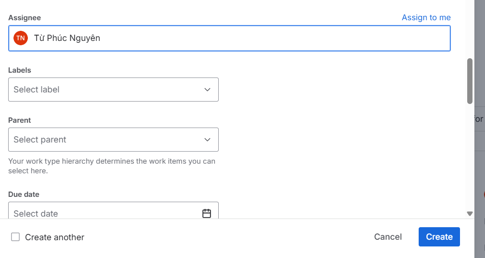


**Bước 4:** Vào Task cha → Linked work item → paste link ticket vừa tạo

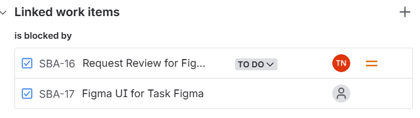
---

## 4. Ticket Naming Convention

| Type                  | Format                                  | Ví dụ                                               |
| --------------------- | --------------------------------------- | --------------------------------------------------- |
| Task                  | `[BE/FE] Module — Mô tả ngắn`           | `[BE] Branch — Setup entity & CRUD API`             |
| Bug                   | `[BUG] Mô tả ngắn + điều kiện tái hiện` | `[BUG] Double booking allowed on same slot`         |
| Request Review        | `[Review] Tên Task cha`                 | `[Review] BE Branch — Setup entity & CRUD API`      |
| Request Review Coding | `[Code Review] Tên Task cha`            | `[Code Review] BE Branch — Setup entity & CRUD API` |

---

## 5. Workflow Trạng thái

```
To Do  ──►  In Progress  ──►  In Review  ──►  Done
             │                    │
             │                    └──► To Do  (reviewer reject)
             └──► To Do  (bị block)
```

| Trạng thái  | Ý nghĩa                                            | Ai chuyển              |
| ----------- | -------------------------------------------------- | ---------------------- |
| To Do       | Chưa bắt đầu                                       | —                      |
| In Progress | Đang làm — Request Review đã được duyệt, đang code | Dev khi bắt đầu code   |
| In Review   | Đã tạo PR, chờ review code                         | Dev khi push PR        |
| Done        | PR merged vào `dev`, CI pass                       | Reviewer sau khi merge |

**Quy tắc:**

- Chuyển **In Progress** ngay khi bắt đầu code, không để To Do khi đã làm
- Chuyển **In Review** cùng lúc tạo PR — tạo ticket **Request Review Coding** assign Nguyên
- **Done** chỉ sau khi PR merged

---

## 6. Điền thông tin Task

```
Title    : [BE/FE] Module — Mô tả ngắn
Assignee : Dev phụ trách
```

> Sprint do Leader kéo vào — dev không cần chỉnh.

---

## 7. Quy trình Log Bug

```
Title    : [BUG] Mô tả ngắn + điều kiện tái hiện
Mô tả    : Làm gì → bị lỗi gì → mong đợi gì
Đính kèm : Screenshot hoặc log
Priority : Critical / High / Medium / Low
```

| Priority | Mô tả                                        |
| -------- | -------------------------------------------- |
| Critical | App crash, không login được, mất dữ liệu     |
| High     | Tính năng chính bị lỗi, ảnh hưởng nhiều user |
| Medium   | Tính năng phụ lỗi, có cách workaround        |
| Low      | UI sai nhỏ, typo, không ảnh hưởng nghiệp vụ  |

---

## 8. Sprint Management

### Sprint Planning

- Lead chuyển Task từ Backlog vào Sprint
- Dev đọc Task → tạo **Request Review** → điền approach trước khi code → chờ Nguyên duyệt

### Definition of Done (DoD)

Một Task được **Done** khi:

- [ ] Ticket **Request Review** đã được Nguyên duyệt
- [ ] Ticket **Request Review Coding** đã tạo với PR link
- [ ] PR được approve ≥ 1 người
- [ ] PR merged vào `dev`, CI pass
- [ ] Task cha chuyển status → Done
